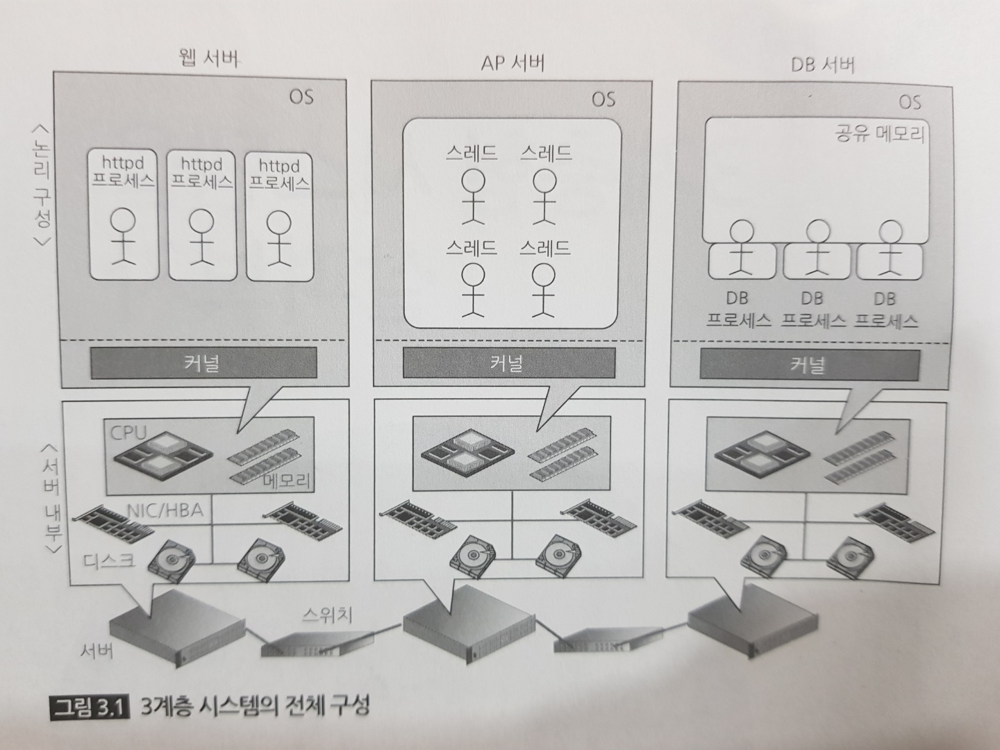

## Chapter 1 인프라 아키택쳐를 살펴보자

인프라 = IT기반이 되는 것.  
아키텍쳐 = 구조

모든곳에서 공통으로 사용가능한 아키텍쳐가 있을까?  
No!  
아키텍쳐나 설계 요소에는 반드시 장점과 단점 공존.  
가장 큰 제약 : 시스템 도입 비용  
ex) 100만명 사용하는 시스템과 10명 사용하는 시스템 예산 차이 큼

### 1.2 집약형과 분할형 아키텍쳐

IT 인프라는 컴퓨터로 구성되며, 집약형과 분할형 존재.

#### 1.2.1 집약형 아키텍쳐

옛날 에는 대형 컴퓨터 이용 모든 업무 처리하는 범용장비가 사용됨  
모든 처리를 한대로 하기 때문에 장비 고장 등으로 업무 멈추지 않도록 고민이 필요.  
복수의 서로 다른 업무 처리 동시 실행 하도록 유한 리소스 관리 필요.  
한대의 컴퓨터지만 안에 여러 프로세스가 존재, 하드웨어 일부 고장에도 작동 필요.

(기간 시스템, 호스트, 메인프레임 등으로도 불림)  
장점: 한대의 대형 컴퓨터. 구성이 간단하다, 리소스관리, 이중화에 의해 안정성 높고 고성능.
단점: 도입비용, 유지비용 크다. 확장성에 한계가 있다.

#### 1.2.2 분할형 아키텍쳐

여러 대의 컴퓨터를 조합해서 하나의 시스템을 구축하는 구조.  
-> 대형 컴퓨터가 했던 처리 다수 소형 컴퓨터 분할 처리.  
서버 분할 일반적인 방식은 수직형과 수평형 2가지 존재.  
수직형: 각 서버별로 다른 역할 담당  
수평형: 각 서버가 같은 역할 담당

장점:

1. 대형컴퓨터는 매우 고가. 저가 장비 이용 전체적인 비용 절감 가능
2. 안정성은 대형 컴퓨터에 못미치지만, 여러 대의 컴퓨터 이용 한 대가 고장 나도 안정성 담보 가능
3. 서버 대수 늘릴 수 있어서 확장성 높다.

단점:

1. 대수가 늘어나면 관리 구조 복잡해짐
2. 한 대가 망가지면 영향 범위 최소화 위한 구조를 검토해야 함

#### 물리 서버와 논리 서버의 차이

분할형 아키텍쳐 이용되는 컴퓨터를 서버라고 함.  
-> 서버는 컴퓨터 자체(하드웨어, 물리적인 의미)를 칭하기도 하고 컴퓨터에서 동작하는 소프트웨어(DB서버, 웹 서버, 논리적 의미)를 칭하기도 함.  
서버의 본래 의미: 특정 역할에 특화된 것

### 1.3 수직 분할형 아키텍쳐

서버별로 다른 역할 담당  
특정 서버 측면에서 봣을 때 역할에 따라 '위'또는 '아래'계층으로 나뉨

#### 1.3.1 클라이언트-서버형 아키텍쳐

클라이언트-서버형은 수직분할형의 한 예이다.  
물리서버는 애플리케이션, 미들웨어, 데이터베이스 등 소프트웨어를 물리서버 상에서 운영  
클라이언트(또는 단말)은 서버에 접속해서 서비스 이용하는 형태

클라이언트-서버형의 특징

- 클라이언트 측에 전용 소프트웨어 설치 (ex 주식 판매 프로그램)
  ->그래프표시나 주가 흐름 분석은 PC에서 하고 주가 데이터 취득은 서버에서  
  ->처리는 각각의 클라이언트 단말에 맡기고 서버는 데이터 입출력만 하면 되기 때문에 처리당 부하량을 낮출 수 있다.  
  -> 부하가 낮은 만큼 소수의 서버로 다수의 클라이언트 처리 가능

클라이언트-서버형의 단점  
업무 애플리케이션 갱신 시마다 클라이언트 측 소프트웨어도 업데이트 해야한다.  
이용자 측에서 불편, 무시하고 넘어가는 경우도 많아 시스템 위험 요소가 될 수 있다.

- 클라이언트 측의 소프트 웨어 정기 업데이트 필요
- 서버 확장성에 한계 발생 가능성

#### 1.3.2 3계층형 아키텍쳐

클라이언트-서버의 발전된 형태  
-> 클라이언트와 서버만 나뉘어 있었기 때문에 서버에 너무 많은 부하가 집중됨  
-> 이에 서버의 역할을 나눠 부하 집중문제를 해결함  
-> 웹 브라우저를 통한 접속(프레젠테이션 계층 있으므로)이므로 클라이언트 업데이트 필요 X

<3계층의 구성>

1. 프레젠테이션 계층

- 사용자 입력을 받음
- 웹 프라우저 화면 표시

2. 애플리케이션 계층

- 사용자 요청에 따라 업무처리

3. 데이터 계층

- 애플리케이션 계층의 요청에 따라 데이터 입출력

웹브라우저 통해 시스탬에 접속(사용자)  
->사용자가 웹 브라우저에 입력하는 화면은 프레젠테이션 계층의 웹 서버에 먼저 전달 됨  
-> 웹 서버는 그 요청을 애플리케이션 계층의 AP(application)서버에 전달  
-> AP서버는 데이텨 계층의 데이터 베이스에 데이터 요청

장점

- 서버 부하 집중 개선
- 클라이언트 단말의 정기 업데이트 불필요
- 처리반환에 의한 서버 부하 저감

단점

- 구조가 클라이언트-서버 구성보다 복잡하다.

##### Memo

웹소켓 : 기존 웹에서는 브라우저가 웹 서버에 요청을 보내서 그것을 받아 처리하는 구조  
-> 웹소캣은 요청이 없어도 웹 서버가 브라우저에 데이터를 전달(푸시)할 수 있다.  
이를 통해 브라우저가 더 많은 것을 실행할 수 있는 형태로 진화하고 있다.

### 1.4 수평 분할형 아키텍쳐

용도가 같은 서버를 늘려나가는 방식  
서버 대수 늘어나면 한 대가 시스템에 주는 영향력 낮아져 안정성 향상

- 수직 분할형과 수평 분할형은 배타적인 관계가 아니다 (대부분 두가지 방식 혼재)

#### 1.4.1 단순 수평 분할형 아키텍쳐

같은 기능 가진 복수의 시스템으로 단순 분할.  
sharding(샤딩), partitioning(파티셔닝)이라고도 부름 .
ex ) 3계층 레이어로 구성된 동일한 구성의 어플리케이션을 서울지사와 부산지사로 나눠 구성.  
-> 필요에 따라 서울지사에 접속해 데이터를 확인하거나 부산지사에 접속해 데이터 확인
거리상으로 멀리 떨어진 시스템에 자주 이용됨.  
 공장처럼 각 거점이 완전히 독립된 운영 하거나, 많은 사용자가 있는 SNS 웹 서비스에서 사용자 ID기준으로 서버를 분할(sharding)하기도 한다.

장점

1. 시스템 둘로 분할됨으로써 전체 처리성능 나눈만큼 향상(부하가 한곳으로 집중되지 않으니까)
2. 각각 독립된 시스템이므로 한쪽에 장애가 발생해도 상호 시스템간 영향 X

단점

1. 업데이트시마다 매번 양쪽시스템을 수정해야함
2. 데이터가 일원화 되어있지 않아 양쪽 데이터 동시 사용 불가
3. 처리량이 균등하게 분할돼 있지 않으면 서버별 처리량에 치우침 발생 가능성

#### 1.4.2 공유형 아키텍쳐

일반 기업 시스템이라면 완전 분리된 애플리케이션 이용하는 경우 드물다.  
공유형에서는 단순 분할형과 달리 일부 계층에서 상호 접속이 이루어짐.  
ex ) 단순 수평 분할형에서 DB데이터 동기화

장점

1. 수평으로 서버 늘리기 때문에 확장성향상
2. 분할한 시스템이 서로 다른 시스템의 데이터 참조가능

단점

- 분할한 시스템 간 독립성 낮아짐
- 공유한 계층의 확장성 낮아짐

##### Memo 가상화

집약형 : 대형 컴퓨터의 높은 비용이 문제, 확장성에 문제
분할형: 안정성문제, 구성이 복잡해짐

<b>가상화</b>: 집약형, 분할형 양쪽 장점을 취하는 접근법
ex) 물리서버 2대 준비, 가상화 기능으로 여러대 가상 서버로 분할.  
->물리서버 이중화 해서 한 대가 망가져도 계속해서 운영가능
-> 리소스의 확장성 보장 가능하며,가상서버 여러대로 처리량을 늘릴 수 있다.

## 1.5 지리 분할형 아키텍쳐

특정 목적에 맞춰 수직, 수평 분할 아키텍쳐 조합한 구성

### 1.5.1 스탠바이형 아키택쳐

스탠바이 구성, 액시브-스탠바이 구성, HA(High availability)구성 이라고도 부름.

물리 서버 최소 두대 준비 한대 고장나면 가동중인 소프트웨어를 다른 한대로 옮겨서 운영하는 방식  
이때 소프트웨어 재시작 자동으로 하는 구조 페일오버(failover)라고 함

단점

- 물리 서버 고장에 대처 가능하지만 보통 대는 페일오버 대상 서버(스탠바이)가 놀고 있는 상태가 되기 때문에 리소스 낭비 발생

->이 때문에 스탠바이 따로 두지 않고, 양쪽 서버 동시에 교차이용하다 한쪽이 고장나면 다른 한쪽으로 트래픽 집중시키는 방식 사용하는 경우도 많다.  
-> 가상화 서버 이용시 서버상의 소프트웨어 뿐만 아니라 다른 물리 서버에 페일오버 하는 방식도 선택지가 될 수 있음.

### 1.5.3 클라우드형 아키텍쳐

사용자 쪽에서 보면 일반 서버처럼 동작하지만, 가상화돼 있어서 사용자는 어느 물리서버에서 동작하고 있는지 모름  
3계층형 시스템의 일부 또는 전부가 클라우드 서비스 제공자가 보유한 물리서버에서 동작  
-> 어떤 계층을 클라우드 상에 배치하냐에 따라 명칭이 다르다.

1. SaaS (Software as a Service) : 서버뿐만 아니라 애플리케이션 포함한 업무 시스템을 클라우드 서비스 회사가 제공.
   -> 사용자는 인프라를 의식할 필요가 없다.
   ex) Yahoo메일, Gmail

2. PaaS, IaaS, DBaaS: 일반적인 3계층형 시스템 구성하는 서버의 일부 혹은 전부를 클라우드 상의 리소스로 대체  
   -> 이 경우 인프라 설계자는 인프라를 의식해서 장단점 고려한 설계 해야함  
   ex) 물리서버 구입에 비해 비용 낮고 바로 사용 가능하지만, 보안문제, 클라우드 서비스 제공자의 네트워크 연장 문제등 있을 수 있다.

양쪽의 장점만을 가져와서 <b>사내 클라우드</b> 구성하는 경우도 많음.

# Chapter 2. 서버를 열어보자

#### 2.1.2 서버 내부 구성

서버의 구조는 기본적으로 PC와 같다.

- CPU(Centeral processing unit)와 메모리는 물리적으로 직접 연결
- CPU중심으로 생각하면 HDD나 네트워크 인터페이스는 메모리에 비해 멀리 있다.

### 2.2 CPU

중앙 연산장치.  
멀티코어화가 진행되고 있으며 코어는 각자 독립된 처리수행.  
명령이나 데이터는 기억장치에 있지만,
웹서버나 DB의 프로세스, 사용자(마우스 키보드 통한 조작)-> OS -> CPU  
-> 이때 마우스, 키보드 하는 처리를 끼어들기(interrupt) 처리라고 부름.

### 2.3 Memory

CPU 옆에 위치하는 기억영역.  
저장된 데이터는 휘발성이지만, 액세스가 매우 빠르다.

메모리 CPU간 통신은 메모리컨트롤러 경유해서 이뤄지며,  
이때 통신이 이뤄지는 데이터 경로를 '채널'이라고 한다.

CPU자체도 레지스터나 1차(L1)/2차(L2)라고 불리는 메모리를 갖고 있다.  
->메모리보다도 빠르지만 용량이 매우작다  
->빈번하게 사용하는 데이터, 명령순서대로 CPU에 가까운 쪽에 캐시된다

- L1캐시(초고속 캐시, 각 코어 전용)
- L2캐시(고속 캐시, 각 코어전용)
- L3캐시(준고속캐시, CPU전체가 공유)

#### 메모리 영역이 몇개나 존재하는 이유

메모리를 이용하려면 메모리 컨트롤러를 경유해서 CPU 밖으로 나가야 함  
-> 이런 처리지연(latency) 피하기 위해서 가장 자주 사용하는 명령/데이터를 코어 가까운 곳에 배치

#### CPU 캐시메모리 영역이 여러 단계인 이유

액세스 속도 때문.  
일반적으로 캐시 메모리가 커질수록 액세스 속도가 느려지므로, 여러단계로 배치해서  
가능한 많은 캐시를 확보.

## I/O 장치

### 2.4.1 하드드라이브

기록영역
장기저장목정의 데이터 저장 장소

- HDD: 메모리와 달리 전기가 없어도 데이터가 사라지지 않음.  
  -> CD/DVD와 같은 구조. 회전판에 데이터 기록됨.  
  -> 회전 구조때문에 속도가 물리 법칙에 좌우되며, 메모리처럼 순식간에 액세스 불가

- SSD(Solid State Disk): 물리적인 회전요소 사용 않는 디스크
  메모리와 같이 반도체로 만들어 졌지만 전기가 없어도 데이터 사라지지 않음.  
  -> 메모리와 기억장치 간 속도 차이가 거의 없어지고 있다.

- 스토리지(Storage 저장소): HDD가 많이 탑재되어있는 저장소  
  I/O의 서브 시스템이라고도 불리는 장치, 내부에는 CPU와 캐시가 존재하고 수많은 HDD 와 여러 기능 탑재.
  -> 서버와 I/O시 HDD가 직접 데이터 교환 X 저장소 캐시를 통해한다.
  -> 저장소 캐시 이용방법은 CPU캐사와 동일
  -> 메모리처럼 고속으로 I/O 가 가능한 하드웨어라는 정도로 알아둘 것.

### 2.4.2 네트워크 인터페이스

서버와 외부장비를 연결하기 위한 외부접속용 인터페이스  
LAN, SAN등 어댑터를 통해 연결됨  
참고: CPU관점에서는 HDD와 네트워크둘다 I/O핸들러 라는 컨트롤러를 거쳐  
통신한다는 점에서 외부I/O라는 의미에서 동일하다.

### 2.4.3 I/O 제어

IOH(I/O Handler): CPU에 물려있는 I/O핸들러. 예전에는 메모리관련 I/O처리가 주된 임무였으나, CPU로 그 임무가 옮겨가고, PCI Express등 고속ㅊ러리가 필요한 I/O 담당

ICH(I/O Controller): USB,CD,DVD등과 같이 고속처리가 필요없는 I/O제어를 담당.IOH간 데이터 전송 제어도 한다.

### 2.5 버스

서버 내부에 있는 컴포넌트들을 서로 연결시키는 회선.
버스에서 중요한건 어느정도의 데이터 전송 가능한지 의미하는 대역이 중요  
-> 한번ㅋ에 데이터 보낼수 있는 데이터의 폭(전송폭) 1초에 전송할 수 있는 횟수

- 버스대역: 메모리와 CPU는 대량의 데이터 교환을 필요로 하므로 CPU쪽 버스대역이 가장 크다. 즉 1초당 전송량이 크다.  
  반대로 USB포트는 60MB/S전송 능력을 가진 규격으로 저속이기 때문에 ICH(I/O Controller)앞에 배치해도 문제가 없다.

버스 흐름에서 중요한 것은 CPU와 장치사이 병목현상이 없어야 한다는 것이다.  
외부장치 연결 시의 버스 대역에 관한부분 주의

> TODO PCI Express 2.0 알아보려면 알아볼것

### 2.6 정리

HDD 부터 CPU까지 데이터가 도달하는 여정  
CPU코어 <->레지스터<->L1~3캐시<->메모리<->IOH(IO Handler)<->HBA<->저장소캐시<->HDD

- CPU에 가까울 수록 고속이고 멀수록 대용량인 것을 알 수 있다.

# Chapter3 3계층형 시스템을 살펴보자

## 3.1 3계층형 시스템의 구성도

- 각 계층의 서버는 스위치를 통해 연결되어있다
  

## 3.2 주요개념

- OS를 이해하려면 프로세스와 스레드, 커널을 이해해야 함

### 3.2.1 프로세스와 스레드

#### 프로세스가 시작되는 흐름

1. 특정 프로그램은 서버 내부의 디스크에 설치된다.
2. 시작 의뢰 있으면 '커널'이 프로세스를 작성하고 요청 분량만큼만 메모리 공간할당.
3. OS 상에서 프로세스시작 -> 사용자 요청 받을 수 있게 됨

- 프로세스 및 스레드는 프로그램 실행파일 자체가 아님.
- OS 상에서 독립성 가지고 동작하는 것.
- 프로세스는 실행시 독자 메모리 공간을 점유하며, 프로세스 안에서 스레드들이 실행 됨. 한 프로세스 안에서 실행되는 스레드 들은 메모리 공간을 공유
  -> 프로세스 실행시 커널에 의해 메모리공간이 확보 됨

#### 프로세스 스레드 선택기준

애플리케이션 목적에 따라 프로세스와 스레드 특성을 생각해 개발자가 정함.

- 프로세스:
  장점: 개별처리 독립성이 높다.
  단점 : 메모리 공간 할당하므로 프로세스 생성시 CPU부하가 스레드보다 높음  
  -> 멀티 프로세스 애플리케이션에서는 프로세스 생성 부담 낮추기 위해 미리 프로세스 시작해 둠 (연결 풀링)

##### Memo

프로세스도 독자 메모리 영역 가진 상태로 프로세스간 메모리공간을 공유하는 형태를 취하는게 가능하긴 함  
ex)  
프로세스 간 공유하고 싶은 캐시로 저장하는 데이터는 공유공간에  
프로세스 단독으로 이용하는 데이터, 자신이 계산한 데이터는 전용 메모리에 둔다.

- 스레드:  
  장점: 생성시 부하가 낮다  
  단점: 메모리 공간 공유해 의도치 않은 데이터 읽기/쓰기 발생할 수 있음.  
  ->스레드세이프 이슈

ex)  
생활비 통장을 사용하는 가족에 비유해보면  
프로세스: 맞벌이 부부처럼 생활비 통장을 각자 관리  
쓰레드: 통장한개로 아내가 남편의 부양가족 되는느낌, 부양가족이 늘어나도(쓰래드가 늘어나도) 통장한개로 생활한다

### 3.2.2 OS 커널

- OS에서 커널은 심장이자 뇌이며 척수. ->OS의 본질이며 나머지는 덤
- 커널 덕분에 개발자는 하드웨어나 다른 애플리케이션에 미치는 영향 의식하지 않고 개발 가능.
- OS처리는 원칙적으로 커널 통해 이뤄짐

#### 커널의 역할 6가지

1. 시스템 콜 인터페이스: 프로세스나 스레드로부터 명령 받는 인터페이스 + 입력장치(키보드, 마우스)입력 (inturupt)

2. 프로세스 관리: 가동되고 있는 프로세스 관리와 CPU이용 우선순위 등 스케줄

3. 메모리 관리: 서버 상의 메모리를 단위크기(예를들어 4kb)블록으로 분할해서 프로세스에 할당

4. 네트워크 스택: 네트워크 관리
5. 파일 시스템 관리
6. 장치 드라이버: 디스크, HBA 등 물리 장치와 작업

#### 1. 시스템 콜 인터페이스

프로세스/ 스레드에서 커널로 연결되는 인터페이스.
애플리케이션이 OS서 어떤 처리를 하고 싶으면 시스템 콜이라고 하는 명령 이용해서 커널에 명령 내림.  
이때 명령이 인터페이스를 통해 전달됨-> 은행이나 구청 접수창구 같은 역할  
ex) 프로세스들은 디스크I/O, 네트워크I/O or 새로운 프로세스 생성시 시스템콜호출해서 커널에 명령 내림  
-> 프로세스의 관점에서는 디스크I/O, 네트워크I/O는 동일한 시스템콜이라는 점에서 차이가 없다.

#### 2. 프로세스 관리(OS에 있어 가장 중요한 기능)

OS상에서는 수십, 수백, 수천개의 프로세스를 가동할 수 있다.  
But, 물리서버의 CPU 코어 수는 많아야 수십개  
언제 어떤 프로세스가 어느정도의 CPU코어를 이용 가능한지, 처리순서는 어쩔지 관리하는 것이 이 기능의 역할.

#### 3. 메모리 관리

메모리 영역을 관리한다. 프로세스 관리는 CPU관리했지만 메모리 관리에서는 물리 메모리 공간의 최대치를 고려함.  
프로세스가 이용하는 독립메모리 공간 확보 or 상호간 참조 영역 지키기 위해 독립성 관리.  
이 기능이 없으면 각 프로세스는 자신 이외의 프로세스가 사용하고 있는 메모리 영역을 일일이 파악해야 하므로 애플리케이션 개발이 매우 어려워진다.

#### 5. 파일 시스템 관리

파일시스템용 인터페이스관리.
파일 시스템은 OS 기능의 하나로서 물리 디스크에 제공된 데이터 관리하는 기능  
각종 파일들의 데이터는 디스크상에서 구분표시도 없이 '010110'과 같은 숫자집합에 불과함.  
->파일시스템 덕분에 애플리케이션은 '파일', '디렉토리'단위로 데이터 작성 삭제 가능

- 프로세스(스레드)는 편리성 때문에 모든 것을 파일단위로 생각함
  -> 커널에서 파일시스템의 인터페이스로 동작해주기 때문에 가능  
  -> 덕분에 프로세스는 물리디스크 구조나 데이터 배치 상태를 고려할 필요가 없다
- 파일시스템은 여러 프로세스가 공유한다.

#### 6. 장치 드라이버

디스크나 NIC(Network Interface card 렌카드) 등 물리장치용 인터페이스 제공.  
다양한 장치들은 각 제조사별로 OS에 대응하는 드라이버를 준비해 커널을 통해 애플리케이션에 일관된 인터페이스를 제공한다(커널의 인터페이스를 통해 각 물리장치를 은폐)  
-> 이렇게 되지 않으면 각 장치별로 장치의 인터페이스에 맞는 애플리케이션을 개발해야함

#### 커널은 결코 견고하지 않다.

커널 설계 및 구현방식은 크게 두가지

1. 모놀리식(단일형) 커널:

- OS의 주요 구성요소 모두 하나의 메모리공간을 통해 제공  
  대표 예시) 유닉스계열의 OS, 리눅스

2. 마이크로(작다) 커널

- 최소한의 기능만 커널이 제공하고 그 외 기능은 커널 밖에서 제공(더 심플한 형태의 커널)  
  대표 예시) 애플이 MAC OS

대부분의 아키텍쳐는 양쪽의 장점을 취하고있다.

## 3.3 웹데이터 흐름

### 3.3.1 클라이언트 PC부터 웹 서버(프레젠테이션 계층)까지

PC에서 웹프라우저 실행해서 웹서버에 요청을 보내고 AP서버로 질의하기까지 흐름

\<PC>

1. OS상에서 브라우저 실행
2. 커널경유해서 디스크에있는 브라우저 응용프로그램 읽어서 메모리에 상주시켜 브라우저 프로세스 실행
3. 브라우저에서 주소창에 주소질의
4. 질의는 OS의 시스탬콜로 실행되고 커널을 경유해 NIC(Network Interface card 렌카드)에 네트워크 통신 요청됨
5. 네트워크 경유로 웹서버에 질의

\<이름 해석 name resolution>  
http://jpub.kr질의했다고 치면

- 웹브라우저는 jpub.kr 의 IP주소 알 수 없음.

1. OS의 호스트명, IP주소 변환 테이블을 참조해서 존재하지 않는 경우 외부의 DNS서버에 요청을 던진다.
2. DNS서버에 호스트명이 아닌 IP주소로 지정돼 있는 것은 이때문
3. 전세계 DNS서버는 Root DNS기준으로 트리구조로 돼있음.  
   -> 개별 DNS서버는 정기적으로 부모 DNS서버에서 데이터 받아 최신 IP주소 목록 유지

\<웹서버>(프레젠테이션 계층)

- 웹서버의 역할은 HTTP(HyperText Transfer Protocol)요청에 대해 적절한 파일이나 콘텐츠 반환하는 것  
  -> 텍스트 송수신 위한 약속. 기본 텍스트 데이터에 대한 프로토콜이지만 동영상이나 데이터의 바이너리 데이터 전송에도 이용되고 있음.
- 웹서버 Apache Http Server, ngnix 등등

1. 해당사이트가 어디에 있는지 이름 해석해 해당하는 웹서버에 요청이 전송
2. 웹서버의 'httpd'프로세스가 정적 콘텐츠(디스크에서 읽을지)인지 동적 콘텐츠(AP서버에 질의할지) 판단.  
   2-1. 디스크 내부에 있는정보->시스템콜실행->커널통해 디스크에서 파일 읽어와 응답  
   2-2. AP서버 질의->시스템콜 실행->커널통해 NIC(Network Interface card 렌카드)에 대한 네트워크 통신 요청->스위치 경유해서 AP서버에 질의가 이뤄짐

### 3.3.2 웹서버부터 AP서버까지

'동적콘텐츠'에 대한 요청 처리하는 것이 AP서버.

1. 웹서버에서 온 요청-> AP서버의 NIC경유해서 커널에 의해 끼어들기처리 (inturrupt: 입력장치 입력도 inturrupt라고 함)
2. AP서버의 OS의 JVM상에 돌아가는 스레드가 요청 접수.  
   2-1. 자신이 계산한값은 그대로 리스폰스  
   2-2. DB질의 필요한 부분은 여기서 대기

3. DB접속은 드라이버를 통해서 연결 풀(connection pool)로 관리 됨.

4. DB에 대한 접속 요청은 OS의 시스템콜로 실행되고, 커널통해 NIC에 대한 네트워크 통신 이뤄짐.
5. 네트워크 경유로 DB서버에 대한 질의 이뤄짐
   ->이때 AP서버가 DB서버에 접속하려면 '드라이버'필요(커널의 장치드라이버랑 비슷)  
   ->즉, 드라이버 뒷단에 있는 것이 데이터베이스로 가는 인터페이스로 해당 데이터베이스 자체를 은폐하는 역할 함.

#### MEMO 자바가상머신 JVM은 하나의 거대한 프로세스

가상머신이므로 하나의 OS로서 다양한 기능을 가지고 있다.  
->즉 다양한 역할을 하는 복수의 스레드를 갖는다.  
ex)  
사용자 잔금 정보를 요청받았지만 AP서버에 정보는 없다.  
->AP서버의 스레드 DB서버에 질의  
->돌아온 결과를 HTML등으로 정리해서 반환

#### MEMO 캐시서버와 CDN

데이터 필요시 무조건 DB에 접속하는 것이 효율적인건 아니다.  
규모가 작고 갱신 빈도가 낮은 정보(정적 데이터)를 매번 데이터베이스에 질의는 비효율적

- 대안  
  방법1: JVM내부에 캐시로 저장해 두었다가 반환
  방법2: DB서버보다 빠른 '캐시전용서버'만들어 그쪽에 질의
  방법3: 규모가 큰 정적 데이터 전송시 CDN(Content Delivery Network 데이터전송서버)사용  
  ->대부분의 웹 시스템 CDN 사용.  
  ->대량의 데이터 전송에 특화된 것으로 전 세계에 있는 데이터 복사본(캐시)을 배치하는 기술과 병렬 기술 활용해서 처리를 효율화 하고있다.  
  But  
  ->기업형 시스템에서는 CDN 잘 사용되지 않음.
  ->하나의 시스템에 대한 사용자수 제한되 있고, 데이터를 갱신하는 작업이 많기 때문

### 3.3.3 AP서버부터 DB서버까지

DB서버는 SQL해석해 데이터 엑세스 방식 정하고, 디스크나 메모리(공유메모리 영역에 캐시된 데이터 or in-memory DB)에서 필요한 데이터 수집.
-> 속도는 당연히 디스크에서 읽어오는게 느리다.

AP서버로부터 요청이 도착하면,

1. DB프로세스가 요청 접수
2. 이전 사용한 정보는 캐시에 저장하는 구조라 캐시데이터부터 확인하기 위해, 일단 공유메모리영역 검색
3. 공유메모리에 데이터 없을 시 디스크에서 읽는다.
   -> DB프로세스-> 시스템콜 실행 -> 커널경유->디스크 읽어 옴  
   (많은 경우 DB서버 내부에 디스크가 있는게 아닌 대량 데이터 고속 액세스 위한 저장장치전용 서버를 따로 둬 외부의 디스크를 읽어오게 함)

4. 한번 액세스한 데이터는 메모리에 캐시 형태로 저장, 이후 액세스시 재사용
5. AP서버에 결과 반환.

#### MEMO RDBMS와 KVS(Key Value Store)

RDBMS:

1. 표(테이블)로 데이터 표현해 필연적으로 데이터 정리된다.
2. 릴레이션에 의해 테이블 간 관계 표현 (정돈된 형태)

KVS:

1. 데이터 자유로운 형태로 저장가능
2. 여러대 서버에 수평 분할(sharding 샤딩)하기 쉽다  
   -> 단, 자유도 높은 만큼 복잡성이 커져 관리 어렵다.

### 3.3.4 AP서버부터 웹까지

1. DB서버로 부터 돌아온 데이터NIC경유로 커널 거쳐서 원래 스레드로 반환
2. 돌아온 DB데이터, JVM캐시데이터 등 이용해서 필요한 처리해서 돌려줄 데이터 준비. 가공결과 텍스트 데이터라면 HTML XML 동적이미지의 바이너리 데이터 등 일반적.
3. 다시 커널통해 웹서버로 데이터 반환

### 3.3.5 웹 서버부터 클라이언트 PC까지

1. AP서버에서 돌아온 데이터 NIC경유 원래 스래드에 반환 됨
2. httpd프로세스는 데이터를 그대로 반환
3. 웹브라우저가 요청한 데이터 반환.

### 3.3.6 데이터흐름 정리

- 웹 데이터 흐름의 본질 '요청 기반으로 어떤 처리를 하고 필요에 따라 해당 요청을 삼자에게 할당하는 것'

각 서버의 동작은 다르지만 다음과 같은 공통점

- 프로세스나 스레드가 요청을 받는다.
- 도착한 요청을 파악해서 필요에 따라 별도 서버로 요청을 보낸다.
- 도착한 요청에 대해 응답.

# Chapter4 인프라를 지탱하는 기본이론

## 4.1웹 데이터 흐름

### 4.1.1 직렬/병렬이란?

CPU제조사 클럭 속도 올리는 대신 멀티코어를 채용하고 있는 상황과  
방대한 사용자 수 이와 맞물려 병렬처리가 일반화 됨.

직렬: 1차선도로  
병렬: 다차선도로

병렬(3차선)->직렬(1차선)->병렬(3차선)  
다차선도로가 1차선이 됐다가 다차선이 되는경우 합류점이나 분기점에서  
병목이 발생하기 쉽다.

1차선당 속도가 30km일경우 1차선구간을 30x3 =90km로 설정하면 문제가  
없을 수 있지만, 아무리 성능이 좋다고 해도 하드웨어에는 한계가 있기 때문에 전부 3차선 도로로 맞춰주는게 좋다.

여러개의 CPU코어를 배치하면 처리량 늘릴 수 있지만, 병렬화 할 수 있는 처리여야함 (처리가 싱글코어밖에 사용하지 못하면 물리적인 코어 갯수는 의미가 없다)

->처리 흐름에 따라 직렬처리가 분기해서 병렬이 되거나 병렬이 합류해 직렬이 되기도 함

<장 단점>

- 직렬  
  장점: 구조가 간단, 설계나 구현 난이도가 낮다.  
  단점: 복수의 리소스(컴퓨터나 프로세서등) 유용하게 이용 불가.

- 병렬
  장점: 복수의 리소스 유용하게 이용 가능.  
  병렬화 통해 속도는 빨라지지 않지만 단위시간당 처리량 늘어남  
  또한 일부가 고장나도 처리 계속가능

#### 병렬 사용시 주의사항

병렬화에서 분담처리하던 것을 한곳으로 모을때 오버헤드가 발생하기 쉽다.  
-> 병목 발생하기 쉽다.
-> 오버헤드나 구조 복잡화 등 감안해도 효과가 있을 경우 도입할 것

#### 병렬(parallel)과 병행(concurrent)

비슷해 보이지만 다른의미.  
병행 > 병렬

- 병행: 복수의 처리가 실행 상태에 있는 것
- 병렬: 동시에 복수 처리 실행하는 것

한명이 여러일을 동시에 하는 것은 병행이지만 병렬X  
여러사람이 동시에 여러일 하는 것은 병렬.

### 4.1.2 어디에 사용되나?

ex) 웹서버에 다수 이용자 접속하므로, 복수 프로세스가 분담해서 병렬처리  
AP서버에서 JVM프로세스 하나지만 복수의 스레드가 병렬로 처리  
멀티프로세스와 멀티 스레드 모두 이용하는 하이브리드 방식도 가능

여기서 고려해야 할 것  
CPU코어 1개 동시에 사용 가능 프로세스 스레드는  
1프로세스의 1스레드

코어는 1개인데 아무리 프로세스를 여러개로 늘려놔도 동시에 돌아가지 않는다.  
즉, 프로세스나 스레드 수 조정시 CPU코어수도 함께 고려해야한다.  
편의점 계산대가 하나인데 계산대 담당직원을 여럿이어도 소용없는 것과 같다.

오라클DB에서는 클라이언트 요청 접수 서버 프로세스가 클라이언트 접속 수만큼 생성됨.

## 4.2 동기/비동기

2000년대 중반 구글맵 등이 Ajax(Asynchronous JavaScript + XML)사용한 서비스를 공개하며 '비동기'라는 용어 접할 기회가 늘어남

비동기의 본질은 병렬이라고 봐도 됨.  
구글, 페북, 트위터 같이 대량 데이터 처리하는 대규모 웹 서비스가 늘어나며, 멀티 코어화가 진행되고 이에 따라 엔지니어가 비동기로 병렬처리 해야하는 경우가 늘어남.

#### 비동기란?

동기: 누군가에게 일을 부탁하고 그 일이 끝나기까지 기다리는 것  
->의뢰한 것이 끝났는지 확실히 알 수 있음.
비동기: '끝나면 말해'라고 하고 다른일 하는 것 비동기  
즉, 처리를 병행해서 진행할 수 있다.  
->의뢰한 일이 끝났는지 알고 싶으면 별도 방법 이용필요

### 4.2.2 어디에 사용되나

- 링크나 버튼 클릭할 때마다 화면 전체가 바뀌는 것을 기다리는게 아닌 비동기 통신 통해 화면의 필요부분만 갱신가능해 짐
- DBMS에서 사용되는 비동기 I/O  
  DBMS는 HDD등 저장소에 비도기로 쓰기처리 할 수 있음.  
  동기I/O는 I/O가끝날때까지 프로세스가 다음 처리를 하지 않지만,  
  비동기I/O는 대량의 I/O 효율적으로 처리가능  
  -> 저장소의 성능을 충분히 활용 가능
- 메시지큐: 이 경우 처리를 의뢰한 후 의뢰주가 다른 처리를 진행하고 처리 결과는 확인하지 않음.  
  -> 처리실패 감지 못해 후속처리 발생해서 위험 가중될 수 있음.
  ex)
  전화(동기연락수단)  
  이메일(비동기 연락수단): 별도 확인하지 않는이상 답신이 왔는지 메시지가 제대로 전달됬는지 확인할 길 없음.

### 비동기 사용시 주의사항

- 비동기 요구한 처리가 끝나지 않은상태에서 다음 처리 진행해도 문제 없는가
- 비동기로 요구한 처리가 끝났는지 확인할 필요가 있는가

### 동기 사용시 주의사항

- 대기시간이 너무 길어져서 현실적인 요건 충족 힘들 수 있음
- 하드웨어 스팩을 충분히 활용 못할 수 있음

#### MEMO C10K 문제

인터넷 보급과 함께 웹 서비스 접속 사용자수 급증하며 C10K문제 대두

- 하드웨어 성능 문제 없어도 클라이언트 수 많아지면 서버가 고장나는 문제

클라이언트 접속마다 프로세스 생성(1: 1)시 문제

- OS파일 디스크립터나 프로세스 수 최대에 이르거나
- 프로세스당 소비 메모리 쌓여서 메모리부족(티끌모아 태산)
- 프로세스 수 만단위 이상이면 콘텍스트 스위치에 사용되는 CPU사용률 급증
- OS커널 내의 프로세스를 관리하는 관리용 데이터 크기도 커짐

> 이를 위한 대안으로 1프로세스 복수접속 (1:N)
> non-blocking I/O (Node.js, ngnix등이 채택하고 있음)

- 1접속 1스레드 사용시 I/O가 끝나기까지 프로세스가 block 되어 CPU자원이 낭비된다. 이에 I/O요청 보내고 바로 스레드 반환해 다음 요청 을 처리한다.
  -> I/O결과는 의식하지 않으며 에러여부만 돌려받는다.
- 호출 직후 프로그램으로 부터 제어가 돌아옴으로서 시스템 호출 종료를 기다리지 않고 다음 처리로 넘어갈 수 있다.  
  https://grip.news/archives/1304

## 4.3 큐 Queue

우리말로 대기행렬.

- 들어간 순서대로 처리(FIFO First In First Out 선입선출)

HW, OS, DB, APP등 거의 모든 곳에서 이 구조 사용.  
-> 즉, DB, OS런큐, I/O요청 큐 등 부분별로 상태확인하면 처리 지연 여부 확인 가능

CPU나 저장소 같이 복수의 처리가 동시에 진행되는 부분에서는 큐를 많이 사용하기 때문에 성능문제가 발생하기 쉽다.

### 4.3.2 어디에 사용되나

- CPU 처리 기다리는 프로세스나 스레드 행렬(런큐 run queue)
  ->CPU성능 확인시, 사용률 뿐만아니라 런큐 길이도 함께 확인하는게 중요
- 하드 디스크 등의 저장소 읽기 처리 기다리는 I/O요구 행렬
  ->CPU랑은 다르게 디스크상의 특정위치의 데이터에 엑세스할때까지 읽어들여야 하기 때문에 한개의 디스크에 대한 요청은 병렬로 읽어들일수 없다.
- 네트워크 접속 성립 기다리는 접속 요구 행렬

- 이메일은 메시지큐의 일종. 발신자는 상대 상황 개의치 않고 메일을 전송할 수 있기 때문에 수신자의 상황에 끌려다니지 않아도 된다.

리눅스
vmstat  
 r 열에서 CPU처리 기다리고 있는 프로세스나 스레드수 확인가능  
 b열에서 디스크I/O기다리는 프로세스,스레드 수 확인가능

## 4.4 배타적 제어

'다른것을 배제하는 제어'

- 직렬처리에는 배타적 제어가 필요없지만  
  ->혼자쓰는 처리에 필요없음.
- 병렬처리에서는 필요하다.  
  -> 여러곳에서 동시에 사용할 가능성 있기때문에 필요.
  ->이 때문에 배타적 제어 하는 부분 병목이 발생하기 쉽다.
  -> 일반적으로 OS나 DBMS는 병렬처리를 위해 배타적 제어 사용.

- 복수의 처리 공유 자원(CPU,메모리,디스크 등)에 동시에 액세스하면 불일치 발생 가능성있어 배타적 제어로 보호해주어야 한다.

### 4.4.2 어디에 사용되나?

- DB나 CPU, 클러스터DB(여러대의 DB조합해서 하나의 DB로 사용하는 액티브-액티브 클러스터DB) 등.  
  -> 요지는 여러 프로세스나 프로그램단위(DB)가 함께 참조하는 데이터에 lock을 걸고 동시에 교차해서 참조했을때 데이터 정합성 깨지는걸 방지하자는것

<배타적 제어 방식 >

- 래치LATCH(스핀락 SPIN-LOCK):매우 짧은시간 락을 유지함. cpu에서 의미없는 처리를 반복(LOOP) 하면서 대기하는 방식.  
  -> 리눅스 커널은 빅 커널 락 이라는 하나의 스핀락으로 유지 됨

- 슬립락(SLEEP-LOCK): 장시간 락을 유지하도록 큐를 이용해서 관리하는 방식. 슬립해서 기다리면 컨텍스트 스위치가 발생하기 때문에 극히 단시간의 락에서는 cpu를 회전시키며 기다리는 스핀락이 사용되는 것.

### 4.4.3 정리

배타적 제어의 장단점
배타적 제어를 사용하는 경우:

- 장점:  
  공유데이터의 일관성 유지 가능
- 단점:  
  병렬처리가 안된다.

배타적 제어 사용하지 않는 경우:

- 장점: 병렬로 빠르게 처리할 수 있다.
- 단점: 데이터 불일치가 발생할 가능성이 있다. (동시에 공유 데이터를 변경하는 경우 등)

-> 여러 CPU로 병렬처리 하는 경우 공유 데이터 보호 위해 배타적 제어 하지만, 필요 이상으로 배타적 제어 사용시 CPU 여러 개 있더라도 하나밖에 사용할 수 없게된다.
-> 정말 필요한 곳에만 배타적 제어 하고 병렬 처리 가능한 부분 늘리면 CPU 유용하게 활용해서 처리속도 높일 수 있다.

## 4.5 상태저장 / 비저장 stateful/ stateless

IT 시스템이나 컴퓨터에서 상태저장/ 비저장 개념은 거의 모든 곳에 적용되는 개념.

어떤 작업이나 시스탬이 처리를 하고 있을 때 진행 '상태'를 파악해야
하는 경우가 있다.
즉, 상태를 부여한다는 것은 과거에 부여한 '정보'를 저장해서 계속 활용할 수 있따는 것 의미.  
상태를 가지고 있지 않으면 과거 정보를 알 수 없다.

ex)  
상태가 필요한 상황:  
병원 진료시 필요한 기본정보 기입부터 시작해 병의 경과를 의사가 기록해두고 진료결과와 처방으로 약을 받는다.  
상태가 필요 없는 상황:  
슈퍼에서 아무런 절차없이 물건을 집어 바로 계산한다.

이하의 개념을 생각해 적재적소에 사용해야함

상태저장:

- 정보를 많이 갖고있어 세분화된 제어 가능
- 구조가 복잡함
  ex) ssh 상태저장 프로토콜  
  상태 비저장 stateless :
- 고기능은 아니지만 간단함.
  ex) http 상태 비저장 프로토콜

### 4.5.2 자세히 살펴보자

상태저장:

- 부여된 정보에 따라 '상태'가 전이
- 과거 정보 가져올 수 있어 정보에 따른 복잡한 처리 가능
- 단점으로 시스템 복잡성이 커진다는 점과 있을 수 없는 '상태'가 된 경우의 대처도 생각해야 함

상태 비저장:

- 상태 고려하지 않는 간단한 구조덕에 성능과 안정성 쉽게 향상 가능
- 과거정보 없기때문에 (상태를 갖지 않기 때문에) 복잡한 처리 어려움

## 4.5.3 어디에 사용되나?

<컴퓨터 내부구조>  
컴퓨터 내 거의 모든 곳 상태 저장 사용.  
복잡한 처리 구현 위해 상태저장은 필수불가결하다.  
일반 CPU는 하나의 CPU에서 복수의 프로세스 조금씩 처리.  
->특정 시점에 진짜 처리를 하고 있는 프로세스는 코어당 하나  
->즉, 처리를 하지 않는 프로세스는 대기 상태로 있어야 한다.

어떤 명령이나 애플리케이션 실행하면 프로세스가 생성  
-> 이때, 가장 먼저 실행큐 대기행렬에 추가 됨 (실행 가능 상태 runnable)  
-> 실행 될 차례가 돌아온다 (실행 상태 running)  
-> 독점해서 처리 끝내는게 아니고 일정량 처리하면 CPU를 다시 열여주고, 다시 순서 행렬로 돌아가 줄은 선다.(runnable)  
-> 디스크 액세스 등 I/O 대기 발생한 경우 대기 상태 (sleeping)로 전이  
-> 전부 끝나면 종료상태(rerminated)전이

<네트워크 통신 구조>  
브라우저 HTTP서버에 특정 데이터 요청 보내면 상태가 없기 때문에 매번 같은 데이터 반환.  
쇼핑사이트 등의 경우 회원에게는 회원 전용페이지 보여주고 싶지만 과거 상태 모르기 때문에 상대 회원 여부 구별 불가.  
->이를 강제로 처리하기 위해 회원에게 모든 요청시 ID 패스워드를 입력 받아야 하지만, 실제로 이렇게 불편한 페이지는 없다.  
-> HTTP에서는 세션이라는 개념을 이용해서 상태(인증완료 세션 정보)를 저장하기 때문

로그인 등 인증 거치면 서버는 그 상태 저장과 동시에 인증 완료 세션정보를 반환.  
-> 세션정보는 간단히 추측할 수 없도록 매우 긴 영문 숫자조합.  
-> 인증 끝낸 사용자는 통신 시에 세션정보를 서버에 건네기만 하면 이전 처리 상태를 유지하면서 접속 가능하다.

## 4.6 가변길이/ 고정길이

OS 등 소프트웨어가 컴퓨터 디렉토리와 파일등 고정길이를 통해 사용자 사용 쉽도록 하드웨어(메모리, 디스크) 은패

고정길이:

- 쓸데없는 공간이 생기지만 성능면에서 안정적
- 칸막이 조절 불가해서 칸마다 넣을 책의 종류가 정해져 있는 고정된 책꽃이  
  -> 틀별로 넣을 종류와 크기가 정해져 있어서 원하는 것에 쉽게 액세스 가능

가변길이:

- 공간을 유용하게 쓸 수 있찌만, 성능면에서 불안정
- 칸막이 조절 가능해서 남는 공간 없이 책을 꽃을 수 있는 책꽃이  
  -> 저장 시의 데이터 크기 절약 가능하지만 채워 넣다보니 액세스하기 복잡해짐

### 4.6.2 어디에 사용되나?

- 윈도우 일반적으로 NTFS라는 파일 시스템 사용.  
  파일시스템의 하나의 고정길이 틀 4096(4KB)  
  모든 파일은 4KB틀로 저장되며 실제 크기와 디스크 할당크기가 4KB단위로 필요에 따라 할당  
  12바이트짜리 텍스트 파일도 디스크 할당크기는 4KB

- 네트워크 경유 데이터 전송시에도 고정길이로 할지 가변길이로 할지 고려해야 함  
  -> 데이터 전송시 쪼개서 보내는 단위가 된다고 생각하면 됨

일반적인 이더넷(ethernet)의 MTU(Maximum Transfer Unit)는 1500바이트로, TCP/IP 헤더 합계 40바이트이기 때문에  
MSS(Maximum Segment Size)는 1460바이트  
-> MTU(1500바이트) - TCP/IP헤더(40바이트)
-> 즉, 데이터 1460 단위로 쪼개져서 전송된다

## 4.7 데이터구조 (배열과 연결 리스트 linked list)

### 4.7.1 데이터구조(배열 연결리스트)란?

다양한 구조를 이해하기 위한 가장 기본구조.

배열:

- 같은 크기 상자 '빈틈 없이' 순서대로 나열(인덱스만 알면 바로 탐색가능)  
  -> '빈틈없이'= (배열 도중에 데이터 추가시 모든 블록 뒤로), (배열'도중에' 삭제시 모든 블록 앞으로)
  -> 추가/삭제가 느릴 수 있다.

연결 리스트:

- 상자를 다음상자의 위치정보를 가진 형태로 연결한 형태.  
  연결되있어서 배열처럼 빈틈없이 나열할 필요 없지만, 상자를 찾으려면 끝에서부터 순서대로 하나씩 상자 내부 확인 필요.
  -> 탐색이 느리다 (첫번째부터 순서대로 가지 않으면 액세스할 수 없다)  
  -> 도중에 추가/삭제하려면 주변상자가 바라보는 주소만 바꿔주면 된다

### 4.7.2 어디에 사용되나?

1. 해시테이블:

- 탐색이 빠른 배열을 차례나 색인 같은 형태로 나열하고
- 데이터 추가, 삭제가 빠른 연결리스트를 하나하나의 내용으로 사용
  -> 트리의 가지들이 한칸한칸 연결되는 형태니까 연결리스트

2. 오라클 DB의 예  
   -> 오라클DB SQL파스해서 실행 후 결과 반환  
   -> 한번 실행된 SQL 관련 정보 메모리에 저장  
   -> 이때 사용되는게 해쉬테이블 자료구조.  
   -> 파스한 SQL재사용함으로써 CPU사용 시간 절약  
   ->특히 동일 SQL이 동시에 대량으로 실행되는 웹서비스나 주식거래 사이트 등의 OLTP시스템에선느 이런 재사용 구조에 의해 CPU사용시간 큰폭으로 줄일 수 있다.

<해쉬테이블 사용하는 이유>  
-> 한번 실행된 SQL 관련 정보 메모리에 저장  
-> 메모리가 부족하면 실행되고 있지 않은 SQL은 해제한다.  
-> 이런 SQL은 여기저기 산재하기 때문에 추가 삭제가 빠른 연결리스트를 사용하면 해제 처리를 빠르게 할 수 있다.  
-> 하지만 연결리스트는 탐색이 느리기 때문에 SQL실행시 재사용할 정보를 찾는데 시간이 걸린다.  
-> 그래서 탐색에 배열을 사용.
But 배열은 고정길이 데이터가 고정되있고,  
SQL의 길이는 제각각이라 배열로 관리할 수 없다.  
-> 따라서 해시 함수 이용 SQL을 고정길이 해시 값으로 변환한다.  
-> 이 해시한 값 배열로부터 연결리스트 찾아가면 빠르게 탐색가능.

-> 해시테이블은 리눅스의 OS커널의 데이터캐시, KVS(Key Value Store) 등에서 사용

### 4.7.3 정리

배열

- 장점: N번째 요소 탐색 빠르다
- 단점: 중간에 데이터 추가 삭제 느리다.

연결리스트

- 데이터 추가, 삭제 빠르다
- N번째 요소 탐색 느리다.

해시테이블  
->배열, 연결리스트의 상호 장점만을 조합해서 약점 보완한 데이터 구조

## 4.8 탐색 알고리즘(해시/ 트리 등)

### 4.8.1 탐색 알고리즘(해시/트리)란?

- DB에서 인덱스 사용하면 왜 검색이 빨라질까?
- 인덱스를 사용한다고 항상 빨라지는 것이 아닌 이유는?
- 기존 DBMS와 인메모리 DB에 적합한 인덱스가 다른 이유는?

이번 장에서는 필요한 데이터 신속하게 찾기 위한 방법 소개.

데이터 구조: 데이터 정리방법  
탐색 알고리즘: 찾는 방법

이 둘은 땔래야 땔 수 없기 때문에 '알고리즘과 데이터 구조'라는 식으로 함께 다뤄지는 경우가 많다.

예를 들어 '영한사전' 알파벳순으로 페이지가 정렬(데이터구조), 알파벳으로 찾기(알고리즘) 쉽도록 되있음.

- 필요한 때에 필요한 데이터 빠르게 찾기 위해 데이터 정리 필요.
- 데이터 찾을 때의 데이터 구조와 데이터 저장방식(메모리, HDD, SSD 등) 특성에 따라 적합한 데이터 정리 방법 달라짐

### 4.8.2 어디에 사용되나?

<DBMS의 경우>

- 관건은 얼마나 적은 노력으로 원하는 데이터 추출하느냐.  
  ->SQL튜닝 시 풀스캔이라 느렸는데 인덱스 생성해서 인덱스 스캔하니 빨라졌다.(풀스캔 vs 인덱스스캔 빠른건 경우에 따라 다름)

인덱스가 없을때

1. 애플리케이션이 select ~~ where EMPNO=1 이라는 SQL을 발행했다
2. 원하는 데이터 한건이지만 인덱스 없어 풀스캔  
   ->테이블 전체데이터 디스크에서 메모리로 올린 후 모든 데이터 조사
3. 결과를 리턴  
   -> 공유메모리에 데이터 블록 두는건 재샤용을 위해서임. 거대한 테이블의 데이터 블록을 공유메모리에 두면 다른 테이블의 데이터 블록이 메모리에서 제거되기 때문에 캐시하지 않는 경우도 있다.

->풀 스캔은 데이터가 정렬돼 있지 않으면 차례도 색인도 없는 사전에서 단어를 찾느 ㄴ것과 같음

인덱스가 있는경우  
DBMS인덱스에는 몇 가지 종류가 있지만,  
일반적으로 자주 사용되는 것은 B트리 인덱스(B-, B+, B\* 등 여러 종류 있음)

- 인덱스 있으면 최소한의 필요 블록만 읽으면 된다.

1. 애플리케이션이 select ~~ where EMPNO=1 이라는 SQL을 발행했다
2. 인덱스에서 필요한 데이터 있는 곳 조사해서 필요한 데이터 블록만 읽는다.  
   -> 책의 색인 조사해서 필요한 페이지만 읽는 방식과 같다.
3. 해당 테이블에서 원하는 한건의 데이터가 들어있는 데이터블록만 선택적으로 읽는다.
4. 결과 리턴.

### 인덱스의 구조

- root 블록, branch 블록, leaf블록 으로 구성
- 나무처럼 뿌리 -> 가지 -> 잎 순서 거쳐 잎에 도달하면 원하는 데이터 저장 위치 기록돼 있는 형태.
- 테이블 전체가 아닌 4개의 블록만 읽으면 바로 색인된 데이터를 찾을 수 있다.

<b>But</b>

- 무조건 좋은건 아님.
- 검색이 빨라지는 대신 데이터 추가, 갱신, 삭제 시에 테이블 뿐만 아니라 인덱스 데이터도 갱신해야 함  
  -> 인덱스 갱신 때문에 불필요한 오버헤드 발생 할 수 있다.  
  -> 오버헤드: 주요 처리를 위해 발생하는 간접적인 처리 시간 및 메모리 등의 비용

- 테이블 데이터를 모두 취득해야 하는 경우 등에는 오히려 읽는 블록 수가 늘어날 수도 있다. (테이블 모든 블록 + 인덱스 블록까지 읽어야 해서) -> 디스크 I/O증가

- 또한, DBMS는 인덱스 사용 않고 풀스캔 하는 경우 1회 디스크 I/O로 가능한 한 큰 크기의 데이터 읽어서 I/O횟수 줄이려함
  -> 인덱스 스캔에서는 인덱스 블록을 읽으면서 테이블 블록을 하나씩 읽어 액세스 블록 수가 늘어남과 동시에 I/O횟수도 늘어나서 풀스캔 보다 속도가 느려짐.

- 책으로 따시면 풀 스캔은 색인 보지 않고 책을 첨부터 읽는것
- 인덱스 스캔은 책을 처음부터 읽지만 색인보면서 읽어나가는 것

- B 트리 인덱스 DBMS에서 자주 사용되는 것은 트리 구조 계층이 깊어지지 않도록 디스크I/O를 최소한으로 제어하기 때문.
  -> 반대로 메모리에 모든 데이터 두는 인메모리DB는 디스크I/O신경 쓸 필요 없어 디스크에 데이터 저장된다는 것을 전제로 개발된 DBMS와 다른 접근 필요.(T 트리 인덱스)

- 인메모리 디비에서 사용하기도 하는 T 트리 인덱스는 이진트리의 일종이라 가지가 두 개밖에 없어서 계층이 깊어지지만 키값 비교 횟수가 적어져서 메모리의 데이터 탐색에 적합하다.

- 해시테이블은 등호검색시 최고의 데이터 구조.  
  -> B트리 인덱스가 만능형이라면 해시 인덱스는 전문분야에 특화된 것
  -> 뭔소린지모르겠다 조사해볼것.

### 4.8.3 정리

데이터 구조는 데이터를 찾는 방식, 저장 위치의 특성 고려해서 선택할 필요가 있다.  
DBMS에서 인덱스 만들면 검색은 빨라지지만 갱신 시에 오버헤드 걸린다는 단점 있기 때문에 고려해야 함.

- 해시 테이블: 등호 검색에 강함
- B 트리: 등호 검색과 범위 검색 양쪽 다 강한 만능형 자료구조

- 선형 탐색: 풀스캔 할 경우 n개에 비례해서 탐색하니까. 선형임

- HDD같은 2차 기록 장치의 데이터 탐색에는 B트리가 적합
- 메모리 데이터 탐색 적합한 T 트리

## 5.1 캐시

### 5.1.1 캐시란?

- 사용빈도 높은 데이터 고속으로 액세스 할 수 있는 위치에 두는 것.
- 데이터 재사용 전재로 한다.
  -> 즉, '바로 사용할 테니 일단 여기에 두자' 같은 상황에 씀
- CPU의 1,2차 캐시, 저장소 캐시, OS 페이지 케시, DB 버퍼 캐시, KVS(데이터를 메모리에 캐시하는 것)등 광범위하게 사용.

#### 캐시 도입 적합한 시스탬

1. 참조 빈도가 높은 데이터
   몇번이고 같은 데이터 참조한다면 캐시에 배치, 고속으로 데이터 액세스 한다.
2. 캐시의 데이터가 손실돼도 문제 없는 시스탬  
   -> 읽기 전용 데이터  
   예를 들어 스트리밍 데이터 등 갱신 없기 때문에 캐시에 장애 발생해도원데이터 다시 캐시에 배치하기만 하면 복원 가능.

#### 캐시 도입 부적합 한 시스탬

1. 데이터 갱신 빈도 높은 시스템  
   데이터 갱신시마다 새로 캐시해야 해서 바로 액세스 하는 경우와 차이가 없음

2. 대량의 데이터에 액세스 하는 시스템  
   수백 GB이상의 큰 데이터 참조하는 경우 캐시 크기도 커지며, 캐시에 배치하기까지 많은 시간 걸림

#### 캐시 도입 시 주의할 점

- 데이터가 실제 데이터와 캐시 2중 구조로 저장되기 때문에 리소스 소비가 늘어난다.
- 시스템 기동 직후 등에는 캐시에 데이터가 없기 때문에 원하는 성능이 나오지 않을 수 있음
- 캐시 계층 늘어나기 때문에 시스켐 성능문제, 데이터불일치 문제 발생한 경우 문제 발생을 야기한 용의자가 늘어남
- 캐시 데이터 손실되는 경우 대비해서 복구 순서 설계시에 확립해야 함
- 갱신 데이터를 캐시할 때 캐시가 여러 개 있으면 갱신된 최신 데이터를 서로 뺏으려는 상태가 발생하지 않도록 주의 필요

### 5.1.2 어디에 사용되나

브라우저 캐시

- 웹브라우저가 접속한 페이지 캐시하는 것.  
  -> 웹 서버 접속 줄이고 브라우저 표시를 고속화 가능.

1. 브라우저는 요청된 페이지가 캐시되 있는지 확인한다.
2. 없으면 웹서버에 요청한다.
3. 페이지를 저장한 후 브라우저에 표시한다.

#### 캐시서버

웹 서버 부하를 줄이는 방법으로 웹서버와 클라이언트 간 캐시서버 배치하는 방법이 있다.

1. 클라이언트는 평상시와 같이 웹 서버에 접속하기 위해 DNS에 질의한다.
2. DNS 서버는 웹 서버가 아닌 캐시서버 한 대의 IP주소 반환
3. 캐시서버에 콘테츠 있으면 캐시서버에서 콘탠츠 반환
4. 캐시서버에 없으면 서버에서 취득

단, 요즘은 캐시서버 대신 CDN(Content Delivery Network)이라는 웹 서버나 다른 네트워크에 웹 콘텐츠 캐시를 배치하는 구조( Akamai)이용 하기도 한다.

## 5.2 끼어들기

급한일을 먼저 처리하도록 CPU에 알리는 행위.  
프로그램 가동시 키보드, 마우스등의 입력에 컴퓨터가 우선반응 하는 것은 이 때문(동영상 재생시 정지버튼 입력 등)

이벤트 주도방식

## 5.3 폴링

polling 은 정기적으로 질의하는 것을 가리킴.  
->이를 통해 대상이 어떤 상태인지 어떤 요구를 가지고 있는지 알 수 있음.

집배원의 우편배달을 예로 들면 집배원은 정해진 시간에 우체통 순회해서 편지가 있던 없던 정기적으로 편지를 수집해서 우체국에 모은 후 배달

즉,

- 질의 방향이 단방향이다.
- 질의는 일정 간격을 따라 정기적으로 발생
  -> 이벤트주도 또는 인터럽트(끼어들기)의 반대
- 반복(루프)만 하면 되서 프로그래밍이 쉽다.
- 상대가 응답하는지 확인할 수 있다.
- 모아서 일괄적으로 처리할 수 있다.

### 5.3.2 어디에 사용되나?

ex) NTP 시간동기 처리  
시간 동기란 리눅스에서 정기적으로 실시해서 자신의 시간이 맞는지 확인하는 구조

1. NTP데몬이 NTP서버에 정기적 시간 요청
2. NTP서버가 시간을 반환
3. 시간 차이가 있으면 시스템 시계의 시간 보정

### 적합한 처리

1. 일정 간격으로 실행하면 좋은 처리  
   ex)  
   메일 클라이언트가 메일 수신 확인 시 메일 전송 후 항상 확인할 필요 X  
   또한, 메일 오지 않았어도 수신 확인 동작할 수 있다.  
   ->일련의 처리를 할 때 전처리와 후처리 연계되지 않는 경우에 적합

2. 감시  
   시스템 컴포넌트 다운, 정지한 경우 컴포넌트가 자발적으로 상태 전달 불가.  
   -> 외부에서 정기적으로 상태 확인해서 확인

### 부적합한 처리

1. 상태 아닌 입력 내용에 따라 실행내용 변경하는 처리  
   -> 키보드 입력내용에 따라 처리 결정되는 것은 정기적으로 폴링하는 방식은 맞지 않음. 이벤트나 끼어들기 사용.
2. 처리 우선순위 정해야 하는 처리  
   일정 간경으로 처리 되기 때문에 처리 우선순위 정할 수 없다.

- 네트워크 경유 폴링시 처리 지연시간 줄이기 위해 폴링 간격을 너무 짧게 잡으면 트래픽 양이 증가하므로 주의 필요.  
  또한, 서버의 리소스 소비도 늘어난다.

## 5.4 핑퐁

인프라설계나 성능 튜닝에 중요한 개념.

ex)
물건을 나를때 상자의 크기를 적절히 선택해야함  
 물건을 10 나른다고 칠 때  
상자의 크기가 5라면 2번만에 나르지만  
1이라면 10번 날라야함.  
-> 상자의 크기가 너무 작아 운반횟수가 늘어나는 것을 핑퐁 이라고 할 수 있음.

- 물건을 운반할 때는 상자에 넣으면 효율적으로 관리 가능
- 운반 양에 따라 상자 크기 선택하면 효율적 운반 가능

### 5.4.2 어디에 사용되나?

오라클 DB가 데이터 파일 읽기/쓰기 최소단위인 '데이터 블록' 크기 8KB라고 가정하면 1바이트 데이터 읽는 경우에도 8KB를 읽는다.  
데이터 블록 크기 32KB - > 1바이트여도 32KB

- I/O 크기가 작을 때는 블록 크기를 작게, 크면 크게해야 효율이 좋아짐.

더 아래 계층 고려하면

- DB데이터 파일과 파일시스템 간의 파일블록  
  DB데이터 파일 (블록크기 8KB) 을 ext3 파일시스템(블록크기 4KB) 저장하면, OS계층에서는 2개 블록으로 분할 됨.  
  DB데이터 파일의 블록크기가 8KB면 파일시스템 블록 크기도 8KB가 효율적.

- 데이터베이스 블록과 OS블록, 섹터  
   디스크는 섹터 라는 단위로 읽기/쓰기 하며, 일반적인 섹터 크기 512 바이트.  
  섹터 크기는 하드웨어의 사양. 변경할 수 없다.  
  -> 'DB블록 크기가 OS블록 크기와 다르면 DB블록 크기가 OS블록 크기의 배수가 되는게 좋음'  
  -> 디스크를 꽉 채워서 사용할 수 있다.  
  ex)  
  파일 시스템 블록 크기 7KB  
  오라클DB 블록 크기 8KB  
  오라클 dB가 1블록(8KB)읽으면 디스크에서 14KB(7KBx2)읽어서 그중 6KB는 사용 안함.

브라우저의 예)  
웹사이트 볼 때 PC 내 메모리 있는 데이터 NIC통해 밖으로  
-> 스위치 라우터 경유 웹서버 도착  
-> 이때 데이터는 상자에 든 채 운반된다고 생각하면 됨

웹 브라우저는 OS의뢰 소켓 만들어 통신(OS의 소켓이라는 구조 사용)

1. 소켓 작성하면 소켓 버퍼라는 상자 만들어짐
2. 소켓 버퍼에는 송신 버퍼와 수신 버퍼가 있음
3. 웹 브라우저가 송신하는 경우 송신버퍼사용
4. 이 버퍼가 차면 OS에 의해 TCP세그먼트라는 상자로 분할
5. 송신버퍼가 TCP 세그먼트 분할될 때 MSS(Maximum Segment Size)초과하지 않는 범위에서 분할.
6. TCP 헤더(TCP세그먼트), IP헤더(IP세그먼트), MAC헤더(이더넷 프레임) 라는 편지 수신자 같은 정보 붙여 이더넷 프레임 이라는 상자에 넣어 전송

- 이더넷 프레임의 IP 소켓의 최대 크기 MTU(Maximum Transfer Unit)이라고 함.
- PC로 인터넷 할 때 의식할 필요 없지만 대량의 데이터 고속으로 통신해야 하는 IT시스템 에서는 소켓 버퍼나 MTU크기를 튜닝하기도 함.

- MTU크기  
  MTU(Maximum Transfer Unit):이더넷 프레임의 IP 소켓의 최대 크기  
  웹서버에서 수신 버퍼를 받고 돌려줄 때 경로 도중에 있는  
  라우터의 MTU크기가 작으면 패킷이 분할돼고 오버해드  
  (분할하는 행위로 인한 리소스)발생해서 성능저하 가능성 있음
- 중요한 것은 모든 통신 경로의 파라미터를 적절히 설정해야 한다는 것.  
  일부 설정 변경해도 경로상 모든 통신이 제대로 설정돼 있지 않으면 효과 볼 수 없음.

## 5.5 저널링

journal 은 트랜잭션이나 매일 갱신되는 데이터의 변경이력 가리킴.  
저널을 남겨두는 것을 저널링journaling이라고 한다.  
-> 시스템 장애시 어디까지 정상 처리됐는지, 어디서부터 재실행 하면 좋을지 알 수 있게 하는 기능.

- 데이터 자체가 아닌 처리(트랜잭션)내용을 기록
- 데이터 일관성이나 일치성이 확보되면 필요 없어짐
- 데이터 복구 시 롤백(rollback), 롤포워드(rollforward)에 이용

- 저널링 기법은 데이터베이스의 기본적 특징을 구현하기 위한 방법의 하나로 일종의 로깅(Logging) 기법을 이용한 데이터 백업 체계라고 볼 수 있을 것이다.

- 데이터베이스에서 트랜잭션 단위로 커밋과 롤백이 가능한게 데이터 업데이트 시 원본 데이터 영역에 바로 쓰는 것이 아니라 로그를 기록한 뒤 최종적용을 하거나 취소를 하기 때문인데 이를 파일시스템에 적용한 것이다.

- 파일을 쓰는 작업 시 파일시스템의 특정 영역 저널(Journal)이라 불리는 로그를 기록한 뒤 작업이 정상 완료 시 커밋(commit)을 하면 실제 사용되는 영역에 기록 하는 것이다.

- 이렇게 되면 시스템이 갑자기 종료되더라도 그 위치가 어디인지 파악할 수 있고, 파일 시스템 전체를 검사할 필요가 없어지게 될 것이다. 따라서 파일시스템을 마운트 하는 시점에 일관성 검사 시 소요되는 시간이 굉장히 줄어들 것이다.

#### 장점

- 시스탬 장애 시 복구가 빠르다
- 데이터 복제보다 적은 리소스로 데이터보호 가능  
  ->저널링은 데이터 안정성 높이기 위한 목적으로 사용

#### 적합한 시스템

- 데이터 갱신이 발생하는 시스템  
  데이터를 갱신하는 시스템에서 트랜잭션 내용 기록해 데이터 안정성 향상.

#### 부적합한 시스템

- 데이터 안정성보다 성능 요구 시스템
  저널링 하면 기록 처리 시 오버헤드(기록하는 처리에 드는 리소스)발생.  
  -> 성능 중시 시스템이라면 오버헤드 줄일 방법 검토필요  
  -> 예를 들어 캐시 서버 등 실제 데이터가 다른 장소에 있는 서버에 부적합

### 5.5.2 어디에 사용되나?

데이터를 처리하는 기능의 대부분은 저널링 구현돼 있으며, 다른 데이터 보호 구조도 존재 함.  
-> 저널은 복구 시에 필요해서 일반적으로 실제 데이터보다 먼저 기록 됨
-> 데이터 변경시 저널과 실제 데이터 두 곳에서 I/O발생

#### 리눅스의 ext3 저널링은 최상의 선택

ext3 파일 시스템은 저널링 기능을 갖추고 있으며, 파일I/O도 트랜잭션으로 간주된다.  
 오라클 DB와 달리 트랜잭션 시 버퍼정보 디스크에 기록 X  
 버퍼의 최신데이터 잃을 가능성 있음  
 기본 설정에서는 5초에 한번 기록,
데이터 파손 허용되지 않는 경우 이 간격 더 짧게 설정하는게 좋다

- 'fsck' 명령어 실행으로 복구작업 가능.

1. 사용자 프로세스 파일 갱신요청
2. 저널의 I/O트랜젝션 시작 됨(프로세스의 트랜잭션이력의 기록이 시작 됨)
3. 메타데이터 저널로 복사
4. 트랜잭션 종료하고 사용자 프로세스에게 응답
5. kjournald(5초 간격)에 의한 저널 기록 처리 전에 bdflush를 이용해서 캐시의 데이터가 디스크에 기록된다.
6. 데이터 기록 후 저널 출력(커밋)
7. 메타 데이터가 비동기적으로 출력된다
8. 커밋 후 데이터가 디스크 키록돼 있으며, 불필요한 저널을 개방한다.
9. 실제 데이터와 메타 데이터가 메모리 상에서 갱신 됨

#### 오라클 DB의 저널구조

- Redo 로그 = 오라클DB의 저널

트랜잭션 종료 시(커밋 시)에 버퍼가 디스크에 기록되지만, 기록중인 Redo로그가 파손된 경우, 데이터를 최신상태로 복원할 수 없다.  
-> 이 때문에 오라클DB는 Redo로그를 이중화(이중화된 로그를 멤버라고 부름)해서 관리.

1. <실제 데이터>변경한 블록 데이터 파일에서 읽어 버퍼캐시에서 변경
2. <저널 로그>변경 내용을 로그 버퍼에 기록
   -> 로그버퍼는 [파일3을갱신, 파일1을갱신 같은 트랜잭션내역 큐 되어있음]
3. commit 이 실행된 시점에 LGWR이 버퍼를 로그파일에 기록하고 기록이 끝난 것을 서버 프로세스에게 통지.
4. Redo로그는 재활용 하므로, 옛날 Redo덮어쓰기 전에 아카이브
   하는 경우도 있다.(아카이브 로그 남김)

#### 저널을 사용한 복구 (롤백, 롤 포워드)

- 롤백: 저널 읽어서 트랜젝션 단위로 실제 데이터 과거로 되돌리는 처리
- 롤 포워드: 저널 읽어서 트랜젝션 단위로 실제 데이터 정보 앞으로 진행시키는 처리

- 저널 데이터 메모리의 버퍼에 일단 저장. 이 정보가 디스크 기록 되지 않으면 장애시 잃을 수 있다.  
  ->시스템 요건에 따라 버퍼의 디스크 기록 시점 검토, 조정 필요. 빈도가 너무 높으면 오버헤드도 높아지기 때문.

- 저널은 트랜잭션 단위로 일치성 보증하므로, 트랜잭션 도중에 장애 발생하면 종료되지 않은 트랜잭션이 파괴 됨
  -> 트랜잭션 단위가 너무 크면 도중에 장애 발생할 가능성이 높으므로 트랜잭션 길이에 대한 고려 필요

#### 파일 시스템 종류

ext (eXtended file system): 리눅스 파일 시스템으로 사용, 암호화 지원 X

ext2: 리눅스 파일시스템으로 사용 (ext를 대체하기 위해 고안)
서버의 비정상적 종료 후 재부팅시 데이터 손실을 방지하기 위해 FSCK(복구) 명렁어 추가

ext3: 파일 내용 변경 시 파일 시스템과 바로 동기화 작업이 이루어짐 (저널링 파일 시스템) ext2에서 자료 삭제 및 손실없이 ext3으로 변경 가능

ext4: ext3와 호환이 되며, 큰 용량(16TB)까지 지원, 64bit 공간 제한 X,
삭제 파일 복구 및 점검 속도 ↑

btrfs: 오라클, 후지쯔, 레드햇에서 개발하는 유닉스/리눅스용 파일 시스템이다. B-tree filesystem의 줄임말  
시작은 좀 뜬금없는 편이다. 한 IBM 연구원이 2007년에 만든 Copy-On-Write가 되는 B-Tree를 보고 오라클에서 냅다 주워와서 만들기 시작한 것.

FAT:'FAT(File Allocation Table, FAT16)'는 MS-DOS를 사용하던 시절에 개발된 가장 기초적인 파일 시스템입니다.  
특정 드라이브의 최대 크기는 4GB  
특정 파일 한 개의 최대 크기는 2GB

FAT32: FAT의 문제를 해결하기 위해 MS는 윈도우 95 OSR2(1996년) 버전부터 새로운 파일 시스템 'FAT32'를 도입합니다.  
FAT32로 포맷할 경우  
특정 드라이브 최대 크기는 32GB  
특정 파일 한 개의 최대 크기는 4GB

대부분의 USB 메모리나 SD카드 같은 이동용 저장장치를 FAT32로 포맷해 활용하고 있습니다. 개발된지 오래됐고, 안정적이어서 거의 대부분의 운영체제와 주변기기(예: 디지털카메라, 내비게이션)가 FAT32를 지원(읽기/쓰기)하기 때문입니다. 일반적인 용도로 USB 메모리를 활용하고 있다면 FAT32만으로 충분합니다. 단일 파일이 4GB를 넘는 경우는 고화질 동영상을 제외하면 거의 없기 때문입니다. 반대로 캠코더 같이 동영상 촬영이 주가되는 기기에는 FAT32로 포맷된 이동용 저장장치가 어울리지 않습니다. 캠코더에 FAT32로 포맷된 SD카드를 넣은 후 동영상을 촬영하면 4GB 미만의 동영상 파일이 여러 개 생성되기 때문에 관리가 번거롭습니다.

NTFS(New Technology File System): 윈도우2000부터 도입된 NTFS는 다룰 수 있는 드라이브와 파일의 용량이 비약적으로 늘어났습니다. 현재(윈도우 XP 이후) 특정 드라이브의 최대 크기는 256TB(테라바이트)이고, 특정 파일 한 개의 최대 크기는 16TB(정확히는 16TB - 64KB)입니다. NTFS는 현재 일반 사용자용 저장장치의 표준이나 다름 없는 상황

### 저널링과 COW (Copy-On-Write)

파일 시스템에서 주의 필요한 것은 '하드웨어 장애시의 동작'

- 장애 발생했을 시, 파일에 액세스 하는 프로세스는 파일 기록 도중 장애시 해당 파일 기록 도중 실패한 것인지 기록 끝난것인지 판단할 수가 없음

이를 보증하기 위한 2가지 구조

- 저널링  
  갱신 데이터와 갱신 트랜젝션정보(증감 정보)로 나누어 기록  
  성능과 장애 발생시 대처방법 확보  
  -> 리눅스에서 일반적으로 사용되는 ext3, 4 윈도우즈의 NTFS는 모두 저널링 적용
- COW
  갱신 트랜잭션 정보(증감 정보) 기록X  
  파일 갱신은 '신규 영역'에서 하고 완료시점에 참조할 주소만 바꿔치기 함  
  -> 장애 발생해도 참조주소 바뀌지 않았으므로 다른곳에 영향X
  -> All or Nothing (모두 처리하거나 아무처리도 발생 X)  
  -> 단점은 원데이터 남아있는 상태에서 신규 데이터 기록해 데이터 영역이 최대 2배 필요하다는 점.  
  -> 리눅스에서 주류 될 것으로 예상되는 btrfs에서는 COW채용

### MEMO 버퍼(Buffer)란,

데이터를 한 곳에서 다른 곳으로 전송하는 동안 일시적으로 그 데이터를 보관하는 메모리 영역을 의미합니다.

- 버퍼링(Buffering) : 버퍼를 활용하는 방식 또는 버퍼를 채우는 동작

ex)유튜브와 같은 동영상 사이트에서 동영상을 볼 때  
현재 진행되는 부분(빨간색)  
동영상을 내려받은 부분(회색)과  
앞으로 다운로드가 남은 부분  
->여기서 회색부분이 버퍼

->동영상을 내려받는 속도와동영상을 시청하는 속도에서 차이가 나기 때문에 버퍼를 이용해서 최대한 빠르게 동영상을 내려받는 것.

-> 인터넷이 느릴 경우엔 동영상을 내려받는 속도보다 시청하는 속도가 빨라 중간에 동영상이 멈추게 되는데 이럴 때 흔히 ‘버퍼링 걸렸다’ 라고 합니다.

- 즉, 버퍼(Buffer)는 속도 차이가 있는 장치 사이에서 데이터를 전송할 때 데이터의 손실을 방지하고 효율적으로 사용하기 위한 임시 저장공간이라고 할 수 있습니다.
- 더 간단히 말하자면 중간에 끊기지 않도록 미리 데이터를 받아오는 것을 버퍼라고도 표현할 수 있습니다.
