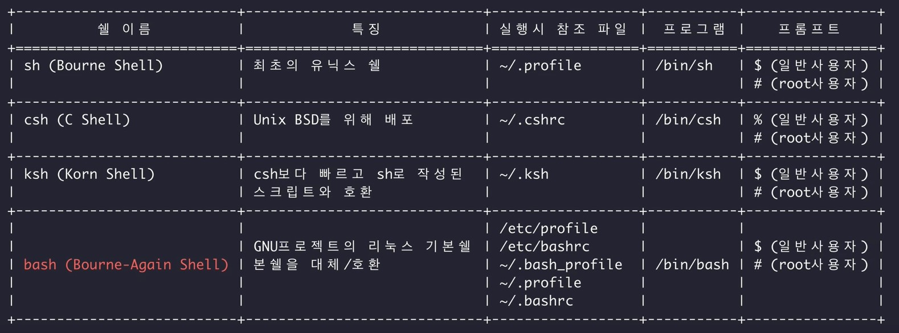

## 리눅스와 쉘

리눅스의 종류

- 리눅스 배포판

  - 데미안 계열
    - 우분투, 민트 : UI 예뻐서 많이 사용됨
    - 칼리: 칼리리눅스 해킹용 툴이 많이 내장되서 유명
  - 슬랙웨어 계열 : 오픈수세
  - 젠투 : 리눅스 만들 수 있을정도의 수준의 사람들이 사소한 튜닝해가며 사용 가능한 OS
  - 레드햇 계열: 페도라 (실험적 코드) 여기서 통과한 코드 레드햇에 반영됨  
     CentOS: 레드햇의 무료판
    -> 유료 리눅스, AWS에서도 지원하는 OS

  - 맥 OS: 유닉스 BSD계열 계승해서 만든 OS

- 쉘의 종류
  
- sh (Bourne Shell) 가장 많이씀, 최초의 유닉스 쉘.  
  가장 많이 쓰는 이유는 함수정도 지원해도 가능한 부분이 많기 때문

- bash : 본쉘의 업그레이드버전. 완벽하게 호환 됨

### 기본 단축키

- Ctrl + a : 라인 맨 앞 이동
- Ctrl + e : 라인 맨 뒤로 이동
- Ctrl + r : history 검색

### 실습환경

https://bellard.org/jslinux/
선택 : Fedora 33 (Linux) Console

1. 리눅스 명령어

- 파일 시스템 관련 명령어

  - cd (Change directory)  
    cd - 상위 디렉토리로 이동

  - ls  
    ls -al 용량과 .파일까지 전부 출력  
    ls -1 세로로 리스트 표시  
    ls -alh 용량을 사람이 읽기 좋은 형태로 보여줌  
    ls -alt 파일을 시간순으로 정렬  
    ls -altr 파일을 시간순의 역순으로 정렬

  ls -al | awk '{print $9}'  
   = ls -1

  - df (Disk free)  
    : 마운트 된 모든 장치에 대한 현제의 디스크 공간 통계 출력

  df -h 사람이 읽기 편한 단위로 용량 보여줌

  - h 옵션은 human readable 사람이 읽기 좋은 형태라는 뜻
